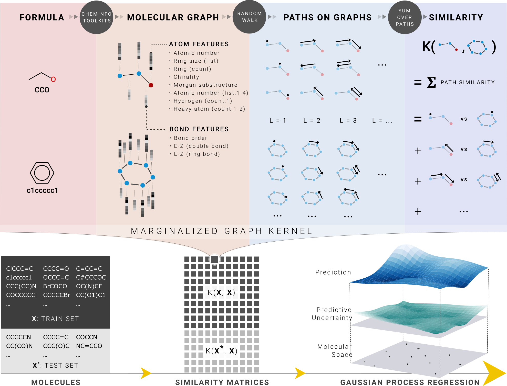

# Chem-Graph-Kernel-Machine
Predicting molecular properties using Marginalized Graph Kernel, [GraphDot](https://github.com/yhtang/GraphDot).

It supports regression (GPR) and classification (GPC, SVM) tasks on
* pure compounds.
* mixtures.

Besides molecular graph, additional vector could also be added as input, such as 
temperature, pressure, etc.

[Predicting Single-Substance Phase Diagrams: A Kernel Approach on Graph Representations of Molecules](https://doi.org/10.1021/acs.jpca.1c02391).

[A Comparative Study of Marginalized Graph Kernel and Message-Passing Neural Network](https://pubs.acs.org/doi/full/10.1021/acs.jcim.1c01118).

<div align="center">
<p></p>
</div> 

## Installation
GCC (7.*), NVIDIA Driver and CUDA toolkit(>=10.1).  
```
conda env create -f environment.yml
conda activate graphdot
```
For some combinations of GCC and CUDA, only old version of pycuda works```pip install pycuda==2020.1```

## Usages
1. The executable files are in directory [run](https://github.com/Xiangyan93/ChemML/tree/main/run).
2. The hyperparameter files in json format are placed in directory [hyperparameters](https://github.com/Xiangyan93/ChemML/tree/main/hyperparameters).
