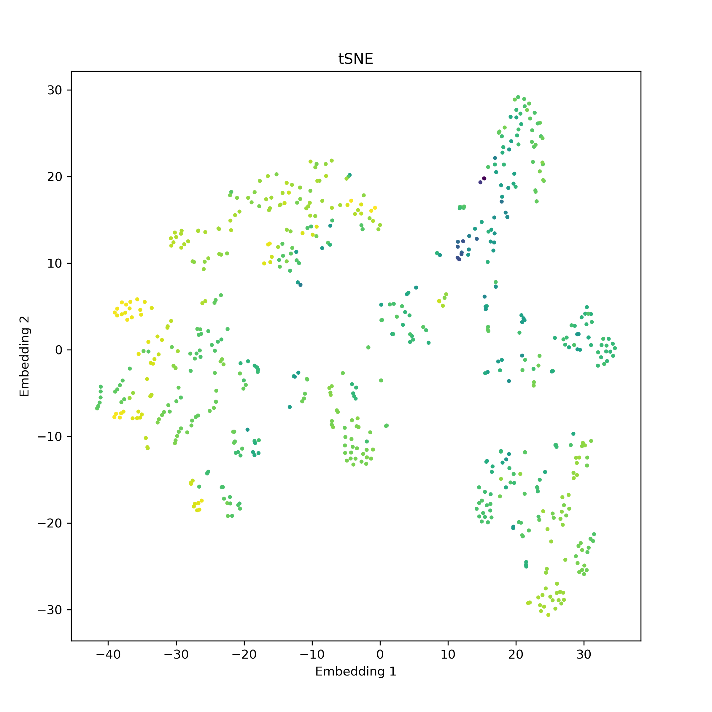
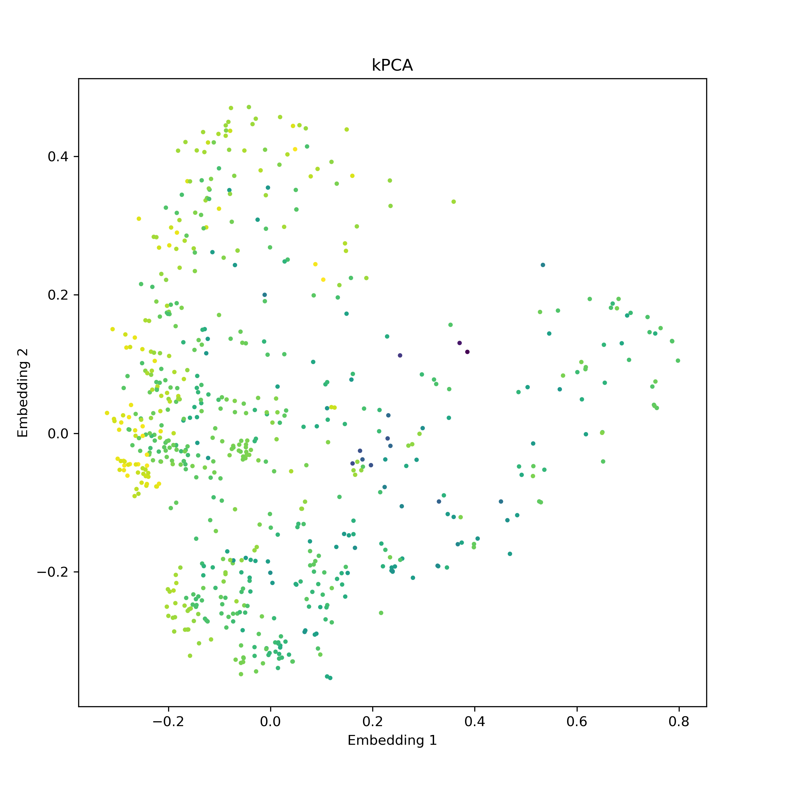

# Chem-Graph-Kernel-Machine Executable Files
This directory contains the all executable files. 


## Data sets.
The input file should be formatted as [datasets](https://github.com/Xiangyan93/ChemML/tree/main/run/datasets). 

Both SMILES or InChI string are valid input of molecules.
Labeled reaction smarts string are valid input of chemical reactions.

## Marginalized Graph Kernel (MGK) Architecture.
The architecture of MGK and associated hyperparameters are defined in a file in 
JSON format. Several choices are provided in ../hyperparameters. "tMGR" use a
tensor-product architecture. "additive" use an additive architecture.
- "tMGR.json" is MGK with molecular-size-dependent normalization.
- "tMGR-Norm.json" is MGK with simple normalization.
- "tMGR-non-Norm.json" is MGK without normalization.
- "tMGR-PNorm.json" is MGK with starting probability normalization.

## Gaussian Process Regression (GPR) for Single-Valued Property
The file datasets/Public/freesolv.csv is the hydration free energy in water. We use
this data set as example.

1. Read Dataset.
    - Read the dataset and preprocess. Save result in freesolv/dataset.pkl.
        ```
        python3 ReadData.py --save_dir freesolv --data_path datasets/Public/freesolv.csv --pure_columns smiles --target_columns freesolv --n_jobs 6
        ```
2. Kernel Calculation
    - Calculate the entire kernel matrix, and saved. Use the non-optimized hyperparameters.
        ```
        python3 KernelCalc.py --save_dir freesolv --graph_kernel_type graph --graph_hyperparameters ../hyperparameters/tMGR.json
        ```
3. Performance evaluation
    - The training set ratio is 0.8. test-*.log are output. 
        ```
        python3 ModelEvaluate.py --save_dir freesolv --graph_kernel_type pre-computed --task_type regression --model_type gpr --split_type random --split_sizes 0.8 0.2 --alpha 0.01 --metric rmse --extra_metrics r2 --num_folds 10
        ```
The performance is not optimal, use RDKit features and optimized hyperparameters for best performance.

## Gaussian Process Regression (GPR) for Temperature-Dependent Property
The file datasets/ThermoSIM/slab-sim.txt is the surface tension at different temperatures. 
We use this data set as example.
```
python3 ReadData.py --save_dir st --data_path datasets/ThermoSIM/slab-sim.txt --pure_columns smiles --target_columns st --feature_columns T --group_reading --n_jobs 6
python3 KernelCalc.py --save_dir st --graph_kernel_type graph --graph_hyperparameters ../hyperparameters/tMGR.json
python3 ModelEvaluate.py --save_dir st --graph_kernel_type preCalc --dataset_type regression --model_type gpr --split_type random --split_sizes 0.2 0.8 --alpha 0.01 --metric rmse --extra_metrics r2 --num_folds 10 --features_hyperparameters 100.0
```

## Use RDKit features
Use both molecular graph (MGK) and 200 molecular descriptors (RBF kernels) that calculated by RDKit as input.

The optimized hyperparameters are provided in datasets/Public/freesolv.
```
python3 ReadData.py --save_dir freesolv --data_path datasets/Public/freesolv.csv --pure_columns smiles --target_columns freesolv --n_jobs 6 --features_generator rdkit_2d_normalized
python3 KernelCalc.py --save_dir freesolv --graph_kernel_type graph --graph_hyperparameters datasets/Public/freesolv/hyperparameters_0.json --features_hyperparameters_file datasets/Public/freesolv/sigma_RBF.json
python3 ModelEvaluate.py --save_dir freesolv --graph_kernel_type pre-computed --task_type regression --model_type gpr --split_type random --split_sizes 0.8 0.2 --alpha datasets/Public/freesolv/alpha --metric rmse --extra_metrics r2 --num_folds 10
```

## Mixtures
Property prediction of mixtures, using CO2 adsorption of ionic liquid as an example.
```
python3 ReadData.py --save_dir co2 --data_path pure_f.csv --mixture_columns smiles --feature_columns T P --target_columns Solubility --n_jobs 6 --group_reading
python3 HyperOpt.py --save_dir co2 --graph_kernel_type graph --dataset_type regression --model_type gpr --split_type random --metric rmse --num_folds 10 --graph_hyperparameters ../hyperparameters/tMGR-PNorm.json --num_iters 100 --seed 0 --alpha 0.01 --alpha_bounds 0.008 0.02 --features_hyperparameters 50.0 10.0 --features_hyperparameters_min 1 1 --features_hyperparameters_max 100 100
python3 KernelCalc.py --save_dir co2 --graph_kernel_type graph --graph_hyperparameters co2/hyperparameters_0.json
python3 ModelEvaluate.py --save_dir co2 --graph_kernel_type preCalc --dataset_type regression --model_type gpr --split_type random --split_sizes 0.8 0.2 --alpha 0.01 --metric rmse --extra_metrics r2 --num_folds 10 --features_hyperparameters 50.0 10.0
```
Binary classification of drug-excipient nano-particle.
```commandline
python3 ReadData.py --save_dir np --data_path datasets/drug-excp/np.csv --mixture_columns pair --target_columns class --n_jobs 6
python3 HyperOpt.py --save_dir np --graph_kernel_type graph --task_type regression --model_type gpr --split_type loocv --metric rmse --num_folds 1 --graph_hyperparameters ../hyperparameters/additive-PNorm.json --num_iters 100 --seed 0 --alpha 0.01 --alpha_bounds 0.001 0.1
```


## Classification
We use bbbp data set as an example.

1. Read data and calculate kernels.
    ```
    python3 ReadData.py --save_dir bbbp --data_path datasets/Public/bbbp.csv --pure_columns smiles --target_columns p_np --n_jobs 6 --features_generator rdkit_2d_normalized
    python3 KernelCalc.py --save_dir bbbp --graph_kernel_type graph --graph_hyperparameters datasets/Public/bbbp/hyperparameters_0.json --features_hyperparameters_file datasets/Public/bbbp/sigma_RBF.json
    ```
2. Gaussian Process Classification
    ```
    python3 ModelEvaluate.py --save_dir bbbp --graph_kernel_type preCalc --dataset_type classification --model_type gpc --split_type random --split_sizes 0.8 0.2 --metric roc-auc --num_folds 10
    ```
3. Support Vector Machine Classification
    ```
    python3 ModelEvaluate.py --save_dir bbbp --graph_kernel_type preCalc --dataset_type classification --model_type svc --split_type random --split_sizes 0.8 0.2 --C 1.0 --metric roc-auc --num_folds 10
    ```

## Classification for chemical reactions
SVC is faster than GPC, as well as lower memory costs.
```
python3 ReadData.py --save_dir rxn --data_path datasets/RxnClassification/test.csv --reaction_columns good_smarts --target_columns reaction_type --n_jobs 6
python3 KernelCalc.py --save_dir rxn --graph_kernel_type graph --graph_hyperparameters ../hyperparameters/reaction.json
python3 ModelEvaluate.py --save_dir rxn --graph_kernel_type preCalc --dataset_type multiclass --model_type svc --split_type random --split_sizes 0.8 0.2 --C 1.0 --metric accuracy --no_proba --num_folds 10
python3 ModelEvaluate.py --save_dir rxn --graph_kernel_type preCalc --dataset_type multiclass --model_type gpc --split_type random --split_sizes 0.8 0.2 --metric accuracy --no_proba --num_folds 10
```

## Hyperparameters Optimization
For regression tasks, it is suggested to minimize the LOOCV loss.

For classification tasks, it is suggested to minimize the roc-auc of 10-fold training/test data splits.

Best hyperparameters can be obtained by applying (1) multiple Bayesian optimization (global optimization) 
from different random seed, and then (2) Scipy optimization (local optimization).

1. Bayesian Optimization. Using hyperopt python package.
    - GPR without RDKit features.
        ```
        python3 HyperOpt.py --save_dir freesolv --graph_kernel_type graph --dataset_type regression --model_type gpr --split_type loocv --metric rmse --num_folds 1 --graph_hyperparameters ../hyperparameters/additive.json --num_iters 100 --seed 0 --alpha 0.01 --alpha_bounds 0.008 0.02
        ```
    - GPR with RDKit features.
        ```
        python3 HyperOpt.py --save_dir freesolv --graph_kernel_type graph --dataset_type regression --model_type gpr --split_type loocv --metric rmse --num_folds 1 --graph_hyperparameters ../hyperparameters/additive.json --num_iters 100 --seed 0 --alpha 0.01 --alpha_bounds 0.008 0.02 --features_hyperparameters 1.0 --features_hyperparameters_min 0.1 --features_hyperparameters_max 20.0
        ```
    - GPC with RDKit features.
        ```
        python3 HyperOpt.py --save_dir bbbp --graph_kernel_type graph --dataset_type classification --model_type gpc --split_type random --metric auc --num_folds 10 --graph_hyperparameters ../hyperparameters/additive.json --num_iters 100 --seed 0 --features_hyperparameters 1.0 --features_hyperparameters_min 0.1 --features_hyperparameters_max 20.0
        ```
2. Scipy Optimization.
   
   This is allowed only for regression tasks. 
   
   The data noise "alpha" in GPR is fixed.
   - GPR without RDKit features.
        ```
        python3 HyperOpt.py --save_dir freesolv --graph_kernel_type graph --dataset_type regression --model_type gpr --split_type loocv --metric rmse --num_folds 1 --graph_hyperparameters ../hyperparameters/tMGR.json --seed 0 --alpha 0.01 --optimizer SLSQP
        ```
   - GPR with RDKit features.
        ```
        python3 HyperOpt.py --save_dir freesolv --graph_kernel_type graph --dataset_type regression --model_type gpr --split_type loocv --metric rmse --num_folds 1 --graph_hyperparameters ../hyperparameters/tMGR.json --seed 0 --alpha 0.01 --optimizer SLSQP --features_hyperparameters 1.0 --features_hyperparameters_min 0.1 --features_hyperparameters_max 20.0
        ```
## Active Learning
1. Supervised active learning.
    ```
    python3 ActiveLearning.py --save_dir freesolv --graph_kernel_type preCalc --dataset_type regression --model_type gpr --alpha datasets/Public/freesolv/alpha --metric rmse --extra_metrics r2 --learning_algorithm supervised --initial_size 2 --add_size 1 --stop_size 400 --evaluate_stride 50
    ```
2. Unsupervised active learning.
    ```
    python3 ActiveLearning.py --save_dir freesolv --graph_kernel_type preCalc --dataset_type regression --model_type gpr --alpha datasets/Public/freesolv/alpha --metric rmse --extra_metrics r2 --learning_algorithm unsupervised --initial_size 2 --add_size 1 --stop_size 400 --evaluate_stride 50
    ```
<div align="center">
<p></p>
</div> 


## Data Embedding.
1. tSNE.
    ```
    python3 Embedding.py --save_dir freesolv --graph_kernel_type preCalc --embedding_algorithm tSNE --save_png --n_jobs 6
    ```
2. kPCA.
    ```
    python3 Embedding.py --save_dir freesolv --graph_kernel_type preCalc --embedding_algorithm kPCA --save_png --n_jobs 6
    ```
<div align="center">
<p></p>
</div>

## Kernel Computation in Blocks
For large data sets, it is convenient to calculate the kernel matrix in blocks 
and then concatenate them. A example is given for freesolv data sets.

1. Compute a sub-block of kernel matrix.
    ```
    python3 KernelBlockCalc.py --save_dir freesolv --graph_kernel_type graph --graph_hyperparameters datasets/Public/freesolv/hyperparameters_0.json --features_hyperparameters_file datasets/Public/freesolv/sigma_RBF.json --block_id 0 0 --block_size 400
    python3 KernelBlockCalc.py --save_dir freesolv --graph_kernel_type graph --graph_hyperparameters datasets/Public/freesolv/hyperparameters_0.json --features_hyperparameters_file datasets/Public/freesolv/sigma_RBF.json --block_id 0 1 --block_size 400
    python3 KernelBlockCalc.py --save_dir freesolv --graph_kernel_type graph --graph_hyperparameters datasets/Public/freesolv/hyperparameters_0.json --features_hyperparameters_file datasets/Public/freesolv/sigma_RBF.json --block_id 1 1 --block_size 400
    ```
2. Concatenate the block kernel matrices.
    ```
    python3 ConcatBlockKernels.py --block_id 2 2
    ```

## Scalable GPs
Read data set and calculate kernel matrix.
```
python3 ReadData.py --save_dir st --data_path datasets/ThermoSIM/slab-sim.txt --pure_columns smiles --target_columns st --feature_columns T --group_reading --n_jobs 6
python3 KernelCalc.py --save_dir st --graph_kernel_type graph --graph_hyperparameters ../hyperparameters/tMGR.json
```
1. subset of data (SoD).
   ```
   python3 ModelEvaluate.py --save_dir st --graph_kernel_type preCalc --dataset_type regression --model_type gpr --split_type random --split_sizes 0.8 0.2 --alpha 0.01 --metric rmse --extra_metrics r2 --num_folds 1 --features_hyperparameters 100.0 --ensemble --n_estimator 1 --n_sample_per_model 5000 --ensemble_rule mean
   ```
2. ensemble SoD.
   ```
   python3 ModelEvaluate.py --save_dir st --graph_kernel_type preCalc --dataset_type regression --model_type gpr --split_type random --split_sizes 0.8 0.2 --alpha 0.01 --metric rmse --extra_metrics r2 --num_folds 1 --features_hyperparameters 100.0 --ensemble --n_estimator 10 --n_sample_per_model 5000 --ensemble_rule weight_uncertainty --n_jobs 10
   ```
3. Naive Local Experts, transductive NLE.
   ```
   python3 ModelEvaluate.py --save_dir st --graph_kernel_type preCalc --dataset_type regression --model_type gpr_nle --split_type random --split_sizes 0.8 0.2 --alpha 0.01 --metric rmse --extra_metrics r2 --num_folds 1 --features_hyperparameters 100.0 --n_local 500
   ```
4. Nystrom approximation.
   ```
   python3 ModelEvaluate.py --save_dir st --graph_kernel_type preCalc --dataset_type regression --model_type gpr_nystrom --split_type random --split_sizes 0.8 0.2 --alpha 0.01 --metric rmse --extra_metrics r2 --num_folds 1 --features_hyperparameters 100.0 --n_core 500
   ```